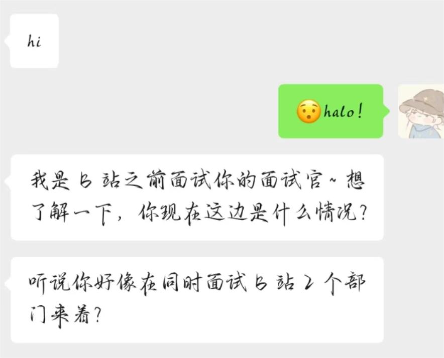
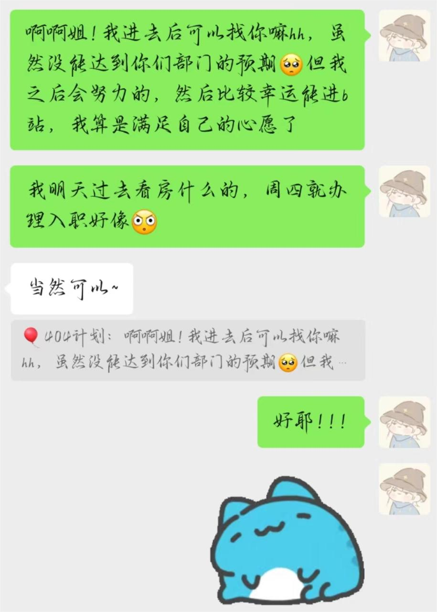

---

# B站 - OVG

投递渠道: <HText type='info'> 官网投递 </HText>

:::tip 时间线

- 2024-08-06 下午一面
- 2024-08-07 下午二面

**后续**：08.19：一面的姐姐来加我！！不过那时候我已经接了另外一个部门的 offer，我想应该是过了吧，好遗憾好遗憾啊呜呜，不过我好像不太敢见她呜呜呜

:::

## 一面

1. 请你讲一下你的项目，要具体一点，包括技术难点，项目优势等
2. webscoket的心跳机制及其应用场景，挖项目的漏洞，怎么去用轮询做弥补
3. 讲一下 XSS 攻击，应用场景及其类型，为什么要考虑这个问题
4. 写一个自定义指令，主要的功能去做过滤，将输入的字符串渲染到页面中
5. 讲一下 React 的 hook 函数
6. 讲一下常见的单位，以及他们的区别；讲一下移动端和pc端适配问题，该怎么进行操作和处理，才能达到效果
7. 单行、多行文本溢出的操作
8. 讲一下用ts做类型转换怎么实现，给你一个json格式的数据，让你定义类型
9. 用 ts 手写 promise.all，promise.then
10. 常规问题：实习几个月....阿巴阿巴

反问

部门是具体业务：讲得有点高级，我的理解主要是做视频那一块的吧

如果能有机会去B站实习，对我的预期：1.基础什么的都过关；2.React、Ts可以回去巩固一下

什么时候能知道结果：应该很快，但具体哪个时间点我不能给你保证哈哈

面试官全程笑脸，感觉聊得特别好，希望能进B站！！！

## 二面

1. 自己对前端哪个方向比较感兴趣
2. 讲一下 GPT 项目吧，背景、亮点以及它的难点......（背书....面试官对这个很感兴趣，所以讲了很多）
3. 讲一下这个流式渲染，并说说它怎么实现，有没有什么可以优化的地方
4. 讲一下这个优化算法吧，以及怎么去量化它的优化指标的？讲一下项目的业务价值以及它的设计模式
5. 大文件上传，它的需求来源以及怎么去优化他，断点续传、秒传（优化好了再优化....）
6. 怎么避免一次性发送上万条请求，该去怎么进行操作才能达到最优解地提高性能，并且保证需求达成呢？
7. 用 ts 手写一个并发请求限制，需要保证每次任务队列里面只有五个任务，然后不断地发送请求，并且要求不阻塞（当时写了个伪代码）；后面它发给我答案，大概有100+行，让我去理解讲给他听，后面他给我讲解，全部删除让我当场复刻出来（感觉特别难，它是类的那种封装形式，我看着有点迷糊，不过好在还是能看懂，也凑巧写得差不多）
8. 手写节流防抖函数，React的一些八股
9. 对于大学和未来的规划（面试官比较满意）

反问：

1. 感觉面试风格跟我以往的感觉不太一样：感觉你基础什么的都能过关，就是解决那个并发请求的时候，理解起来比较慢，有点刁难我了，这道题一般是给社招的同学的

2. 对我的预期：面试官希望我能够过去他们那边实习，对我印象很不错，但是可能还是得排序，大概1-2周才能知道结果

