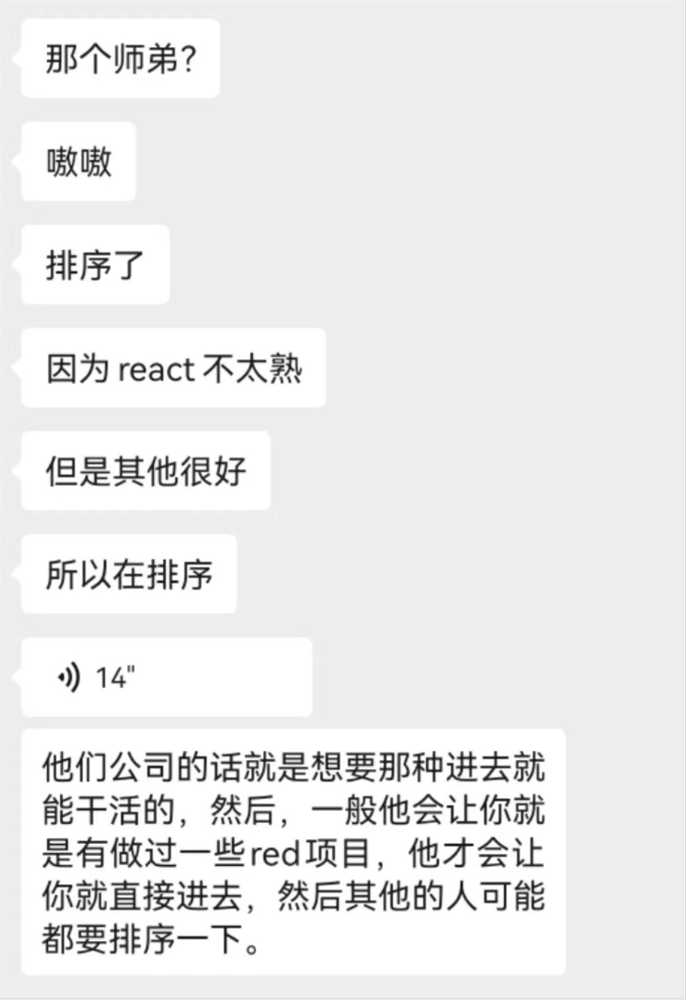

---

# 好未来

投递渠道: <HText type='info'> 师姐内推 </HText>

:::tip 时间线

- 2024-07-11 上午一面

**反思**：问得都很简单，不难，最后因为React不太熟在排序，因为此时他们更希望一进去就能干活

:::

## 一面

1. 日常问了一下实习时间什么的...问我React学的情况（哈哈我知道这场要接受React拷打了）
2. 讲一下你做过的项目吧，以及这些项目的背景、亮点难点？
3. 说一下你讲的这个算法优化做缓存的问题吧（我讲得有点多了，虽然面试官挺满意）
4. 说一下Webscoket吧？以及你为什么要用这个，不用请求去做；细聊Webscoket的具体使用，以及怎么去用轮询的方式去做弥补方案，需要在代码层面上说明
5. 跟他聊软件设计的部分内容？一直在挖我项目设计的漏洞，以及我解决这些问题的漏洞（比如有可能用户在那个瞬间点了很多次，导致返回的消息混乱等，答得还行）
6. 说一下flex布局和对他的理解，容器和项目的关系，flex:1是什么意思
7. es6了解多少？
8. 箭头函数和普通函数的区别？箭头函数的this指向？为什么箭头函数没有this？（这个当时不知道为啥没this）
9. any和unknown的区别？ts内部是怎么去做类型检测的？
10. 聊一下Map和Set吧，map相对于json对象的区别
11. react⽤函数组件多⼀点还是类组件多⼀点
12. 了解了哪些hooks
13. 修改useState中的值，为什么不能直接拿到最后更新的值，以及如何拿到最后更新的值（并且要在代码层面讲一下）
14. 讲一下useEffect，然后说一下它的应用场景（这里他还出了一道题，我没太明白它说什么，就是类似于做一个副作用吧）
15. useRef和useState的区别，为什么会有这个区别在？？讲一下原理
16. 怎么去实现监听另外一个文件里面的数据变化？不能去做传参
17. ⼿写题：使⽤React⾃定义hooks实现节流防抖

反问：

1. 觉得我这次表现怎么样：很不错，他很满意，唯一不足的是React不太熟，其他都还可以
2. 大概什么时候知道结果：这几天吧

后续：

