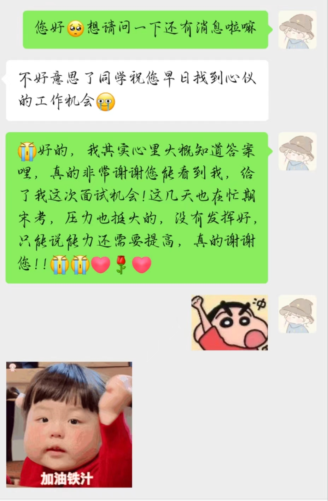

---

# 小红书 - 基础技术团队

投递渠道: <HText type='info'> 部门直推 </HText>

:::tip 时间线

- 2024-07-03 下午一面

**反思**：整体表现得还行，不知道为什么会给我挂了，不过我学到的一点是，要好好把自己的方向说清楚，不然会被面试官误会的！

:::

## 一面

1. 介绍一下你拿得出手的一个项目并说一下这个项目的亮点
2. 说一下这个项目的难点在哪里？（回头看发现我这个说得太多了，靠，说完就深挖）
3. 给你一个场景，就是当你输入url，然后访问一个网页，那个网页从输入到最后我关闭这个浏览器，中间都发生了什么事情（需要特别具体地进行说明，以此来判断你对于浏览器、网络的掌握程度，他会对你这些回答深问，或者提一些你没讲到的东西）
4. 有没有做过后端的东西？NodeJS了解多少？（当时面之前没有问清楚是什么部门的，到它这个问题，我才意识到，这个部门可能是做大前端的，我也没提前复习，跟他聊这个问题都是凭感觉，具体问什么有点忘了）
5. 有没有了解过前后端联调的问题？有没有做过落地的项目？（我说我在软设时候的东西还有帮学院老师做网站、以及自己团队几个人在做个打算上线的东西）
6. HTTP、TCP、UDP协议区别和关系（服了，我当时这么菜的嘛？！回答得不好，因为不清楚，好吧，当时计网压根就没看过，服了，气死我了）
7. 写一道LRU缓存的题目（时间复杂度要O(1)，方法没a对，服了，可能这几天复习得脑子浆糊有点多）
8. 写一道mid难度的链表题

反问：

9. 表现得怎么样：还不错，感觉我可以，应该会给我过（最后还是没给我过）

10. 现在大二，对于未来发展有什么建议嘛（我可能让他以为我方向不明确了，让我先选好方向再说，我猜他应该是没听我好好说话！！！没关系，下次我会说得更清楚的呜呜🥺）

